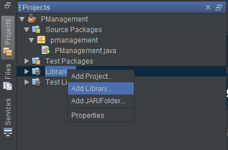

# Oracle Connectivity with Java using NetBeans IDE 8.2

The repo provides a detail procedure to connect Oracle XE 11g with Java.

## Procedure

- Download [NetBeans 8.2 with JDK](https://www.oracle.com/technetwork/java/javase/downloads/jdk-netbeans-jsp-3413139-esa.html) 

- Download [Oracle XE 11g R2](https://www.oracle.com/database/technologies/xe-prior-releases.html)

  - While installing Oracle, the installation wizard requests for a password. Remember or take a note of this password.

  - I will refer this password as _oracle-password_

- Download the [ojdbc-full.tar.gz](https://www.oracle.com/database/technologies/jdbcdriver-ucp-downloads.html) zip folder

  - Extract the zip file and remember the location  
  - We will be using the ojbc6.jar file   
    `D:\Oracle files\OJDBC-Full\ojdbc6.jar`
     
    I will refer this path as **jarfile_location**   

* Open your Java project in NetBeans IDE

  - If possible, create a package and then create your Java classes in that package (Optional)

* Adding Oracle Library

  - `Navigation Pane -> Projects -> Libraries -> Add Library`
    

  - Give a suitable name to the library and click on OK

  - Then click on _Add JAR/Folder..._ button

  - In the filename input, paste the **jarfile_location** and then press OK

  - Select the Library created from the list and then click on _Add Library_ Button

* Open the Start Database App 
  

* Open the Run SQL Command Line APP 
  

  - Give connect system/_oracle-password_ command

Congratulations, your setup is ready for connecting your Java Application with the Oracle Database. Enjoy developing your application.

Cheers!
